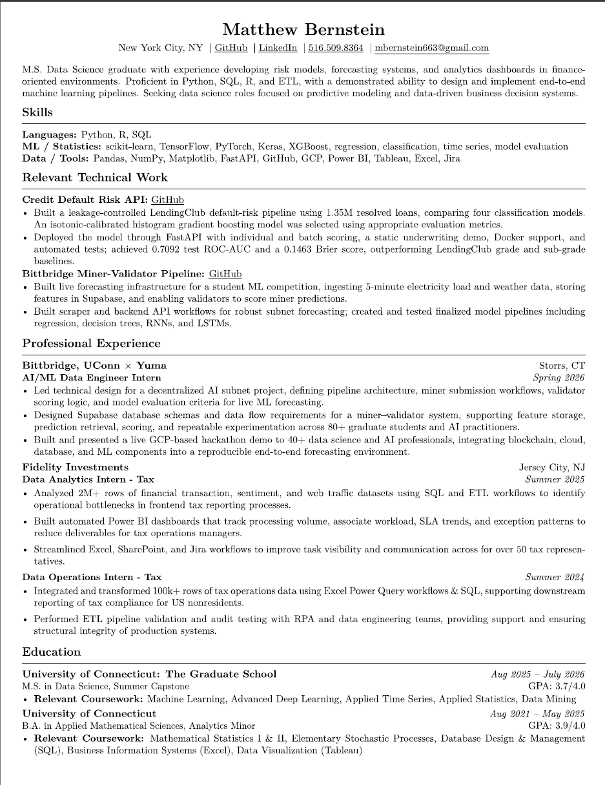
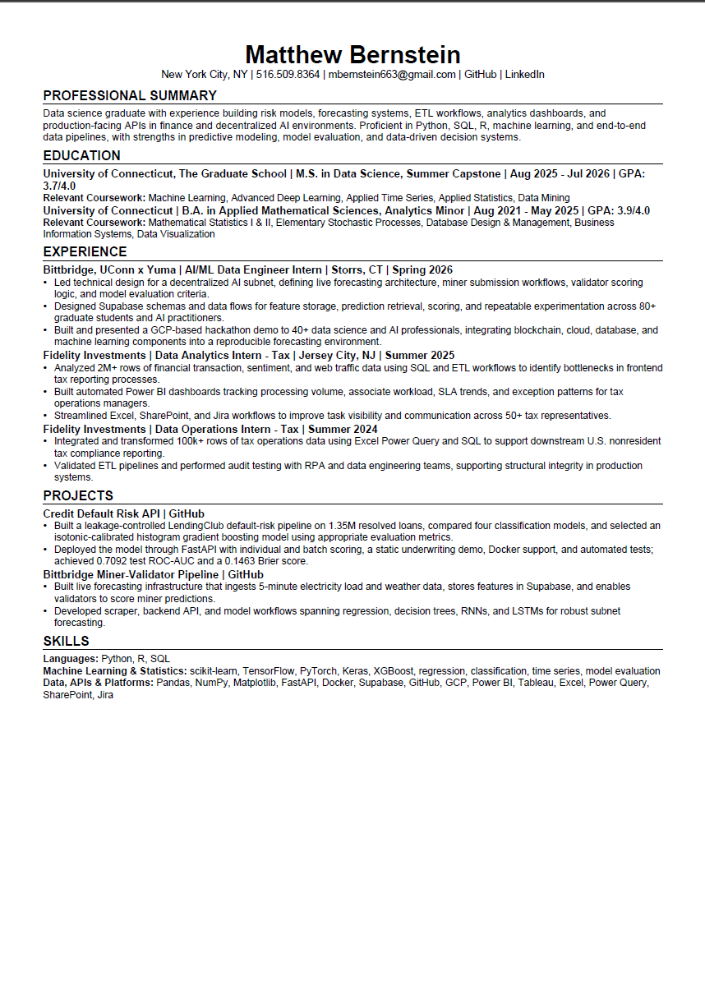

# Day 6: Resume Optimization

Today I am optimizing my resume using ChatGPT and the provided prompt.

## ATS Results:

### ATS SCORE

**Previous Score**: 82/100

**Optimized Score**: 93/100

Replaced the nonstandard “Relevant Technical Work” heading with “Projects,” improving ATS section recognition.
Reorganized the resume into standard Summary, Education, Experience, Projects, and Skills sections.
Rewrote bullets to lead with actions, technical contributions, scale, and measurable results.
Consolidated repetitive wording and shortened dense sentences for faster recruiter scanning.
Added source-supported keywords such as Docker, Supabase, Power Query, and SharePoint to the Skills section.
Standardized company, title, location, and date formatting to improve parsing consistency.
Preserved the strongest metrics, including 1.35M loans, 2M+ rows, 80+ participants, ROC-AUC, and Brier score.

## Observations/Revisions

1. Formatting. The file formatting gave a poor result: The original resume was formatted using Latex which is a lot cleaner than normal pdf renders, resulting in the AI trying to mimick the same format and yielding an unfinished-looking result.
2. Specificities. The new "optimized" resume included stronger buzzwords and got really specific about which tools were included where. I.e. replacing "API integration" with "backend API"- small vocab changes that might more closely match with key phrases that the ATS looks for.
3. Organization. The AI re-organized my resume to fit a more "standard" approach: education first, then experience, then projects, then skills. My current resume almost works in the exact opposite order, but maybe it's better for ATS?

Overall, users should expose the AI to the raw Latex, docx, .dec, or whatever file format they used to render the resume instead of making it work from the ground up. That should give better results.

## Visuals

Original:

Optimized:

